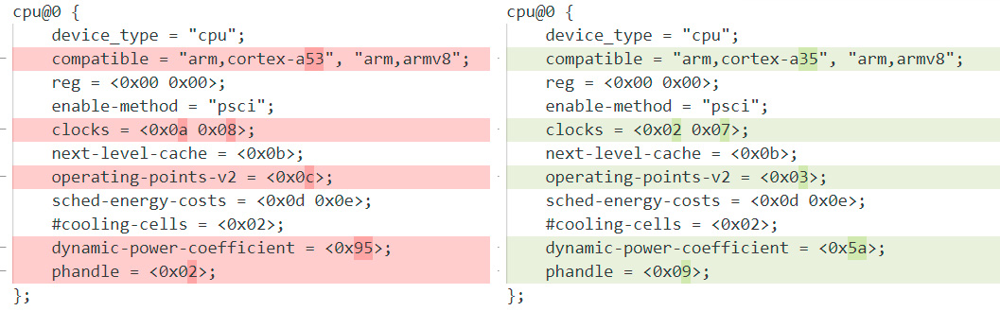
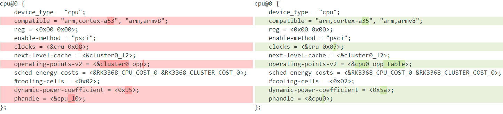

# DTS Cleaner
Comparing the differences between DTB files is quite difficult. This is how a fragment of the diff between two DTB files looks like, after converting them to DTS:

Some of the numeric values are indeed numbers, but others are phandles. So you first have to identify which values are phandles and then what those phandles point to.

This Python script does exactly that, making the diff easier to read:

## Usage
1. Grab multiple DTS files from a similar kernel's source & run the script with each one: `python3 dts_cleaner.py <dts_file>`
   * This allows the script to identify which values are phandles.
2. Run the script with the DTS file you want to clean: `python3 dts_cleaner.py <dts_file>`
3. Done! Most (if not all) phandles should've been replaced with their corresponding labels.